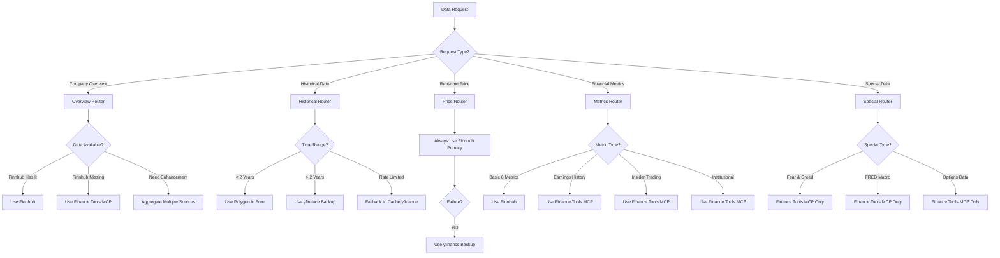

# Sprint 5-6 MCP Integration Architecture & Data Routing

**Created**: September 19, 2025
**Purpose**: Complete technical architecture for Sprint 5-6 MCP integration

## Overall System Architecture

```
┌──────────────────────────────────────────────────────────────┐
│                    FinScope Frontend (Next.js)               │
│  ┌────────────┬─────────────┬────────────┬──────────────┐   │
│  │  Overview  │  AI Insights │ Comparison │ Trends       │   │
│  └────────────┴─────────────┴────────────┴──────────────┘   │
└───────────────────────────────┬──────────────────────────────┘
                                │ HTTP/REST
┌───────────────────────────────▼──────────────────────────────┐
│                    FinScope API Layer (Express)              │
│  ┌────────────────────────────────────────────────────────┐  │
│  │                   API Endpoints                        │  │
│  │  • /api/company/{ticker}/overview                     │  │
│  │  • /api/company/{ticker}/comparison                   │  │
│  │  • /api/company/{ticker}/trends                       │  │
│  │  • /api/company/{ticker}/health-score                 │  │
│  └────────────────────────────────────────────────────────┘  │
└───────────────────────────────┬──────────────────────────────┘
                                │
┌───────────────────────────────▼──────────────────────────────┐
│              Enhanced Data Service Layer (NEW)               │
│                                                              │
│  ┌────────────────────────────────────────────────────────┐  │
│  │               Data Source Router                       │  │
│  │  • Intelligent source selection                        │  │
│  │  • Fallback strategies                                 │  │
│  │  • Rate limit management                               │  │
│  │  • Response aggregation                                │  │
│  └───────────────┬────────────────────────────────────────┘  │
│                  │                                           │
│  ┌───────────────▼────────────────────────────────────────┐  │
│  │              Data Source Abstraction                   │  │
│  │                                                         │  │
│  │  ┌──────────┬──────────┬──────────┬────────────────┐  │  │
│  │  │ Finnhub  │   SEC    │   MCP    │  Cache Layer   │  │  │
│  │  │ (Primary)│  EDGAR   │ Gateway  │   (Redis)      │  │  │
│  │  └──────────┴──────────┴──────────┴────────────────┘  │  │
│  └─────────────────────────────────────────────────────────┘  │
└───────────────────────────────┬──────────────────────────────┘
                                │
┌───────────────────────────────▼──────────────────────────────┐
│                       MCP Gateway Layer                      │
│                                                              │
│  ┌────────────────────────────────────────────────────────┐  │
│  │                   MCP Service Manager                  │  │
│  │  • Health monitoring                                   │  │
│  │  • Connection pooling                                  │  │
│  │  • Error handling                                      │  │
│  └───────────────┬────────────────────────────────────────┘  │
│                  │                                           │
│  ┌───────────────▼────────────────────────────────────────┐  │
│  │                    MCP Clients                         │  │
│  │                                                         │  │
│  │  ┌────────────┬────────────┬─────────────────────┐    │  │
│  │  │  Finance   │ Polygon.io │    yfinance-mcp     │    │  │
│  │  │ Tools MCP  │    MCP     │   (Backup Source)   │    │  │
│  │  └────────────┴────────────┴─────────────────────┘    │  │
│  └─────────────────────────────────────────────────────────┘  │
└───────────────────────────────────────────────────────────────┘

```

## Data Source Routing Logic

### Primary Routing Decision Tree



### Detailed Routing Rules

```typescript
// Data Source Router Implementation Logic
interface RouteConfig {
  primary: DataSource;
  fallback: DataSource[];
  enhancement?: DataSource[];
  cacheStrategy: 'aggressive' | 'moderate' | 'minimal';
  rateLimitStrategy: 'strict' | 'adaptive' | 'none';
}

const ROUTING_RULES: Record<DataType, RouteConfig> = {
  // Basic Company Data
  companyOverview: {
    primary: 'finnhub',
    fallback: ['yfinance', 'finance-tools'],
    enhancement: ['finance-tools', 'polygon'],
    cacheStrategy: 'moderate',
    rateLimitStrategy: 'none'
  },

  // Core Financial Metrics (Our 6 Key Metrics)
  financialMetrics: {
    primary: 'finnhub',
    fallback: ['sec-edgar', 'finance-tools'],
    enhancement: ['finance-tools'],
    cacheStrategy: 'aggressive',
    rateLimitStrategy: 'none'
  },

  // Historical Price Data
  historicalPrices: {
    primary: 'polygon', // Free tier: 2 years
    fallback: ['yfinance', 'finnhub'],
    cacheStrategy: 'aggressive',
    rateLimitStrategy: 'strict' // 5 calls/minute for free tier
  },

  // Earnings History & Analysis
  earningsHistory: {
    primary: 'finance-tools',
    fallback: ['finnhub'],
    cacheStrategy: 'aggressive',
    rateLimitStrategy: 'adaptive'
  },

  // Insider Trading Data
  insiderTrading: {
    primary: 'finance-tools',
    fallback: ['polygon'],
    cacheStrategy: 'moderate',
    rateLimitStrategy: 'adaptive'
  },

  // Institutional Holdings
  institutionalHoldings: {
    primary: 'finance-tools',
    fallback: ['sec-edgar'],
    cacheStrategy: 'moderate',
    rateLimitStrategy: 'none'
  },

  // Market Sentiment Indicators
  fearGreedIndex: {
    primary: 'finance-tools',
    fallback: [], // No fallback - unique to Finance Tools
    cacheStrategy: 'minimal', // Keep fresh
    rateLimitStrategy: 'none'
  },

  // Macroeconomic Data
  macroData: {
    primary: 'finance-tools', // Via FRED API
    fallback: [],
    cacheStrategy: 'aggressive',
    rateLimitStrategy: 'none'
  },

  // News & Sentiment
  newsData: {
    primary: 'finnhub',
    fallback: ['finance-tools', 'yfinance'],
    enhancement: ['finance-tools'],
    cacheStrategy: 'minimal',
    rateLimitStrategy: 'adaptive'
  },

  // Options Data
  optionsData: {
    primary: 'finance-tools',
    fallback: ['yfinance'],
    cacheStrategy: 'moderate',
    rateLimitStrategy: 'adaptive'
  }
};
```

## Sprint 5 Implementation Details (Sep 20 - Oct 4)

### Week 1: MCP Foundation (Days 1-7)

#### Day 1-2: MCP Gateway Infrastructure
```typescript
// backend/src/services/mcp/MCPGateway.ts
class MCPGateway {
  private clients: Map<string, MCPClient>;
  private health: Map<string, HealthStatus>;

  async initialize() {
    // Initialize all MCP clients
    this.clients.set('finance-tools', new FinanceToolsClient());
    this.clients.set('polygon', new PolygonClient());
    this.clients.set('yfinance', new YFinanceClient());

    // Start health monitoring
    this.startHealthMonitoring();
  }

  async query(source: string, method: string, params: any) {
    // Check health before query
    if (!this.isHealthy(source)) {
      return this.fallbackQuery(source, method, params);
    }

    // Execute with rate limiting
    return this.executeWithRateLimit(source, method, params);
  }
}
```

#### Day 3-5: Finance Tools MCP Integration
```typescript
// backend/src/services/mcp/FinanceToolsClient.ts
class FinanceToolsClient implements MCPClient {
  // 15+ financial tools available
  async getTickerReport(ticker: string) { /* ... */ }
  async getEarningsHistory(ticker: string) { /* ... */ }
  async getInsiderTrading(ticker: string) { /* ... */ }
  async getInstitutionalHolders(ticker: string) { /* ... */ }
  async getOptionsData(ticker: string) { /* ... */ }
  async getFearGreedIndex() { /* ... */ }
  async getFREDData(series: string) { /* ... */ }
  async getNews(ticker: string) { /* ... */ }
  // ... more methods
}
```

#### Day 6-7: Data Source Router
```typescript
// backend/src/services/dataSourceRouter.ts
class DataSourceRouter {
  constructor(
    private finnhub: FinnhubService,
    private mcpGateway: MCPGateway,
    private cache: CacheService
  ) {}

  async getData(type: DataType, params: DataParams) {
    const config = ROUTING_RULES[type];

    // Try primary source
    try {
      const data = await this.fetchFromSource(config.primary, params);

      // Enhance with additional sources if configured
      if (config.enhancement) {
        return this.enhanceData(data, config.enhancement, params);
      }

      return data;
    } catch (error) {
      // Fallback strategy
      return this.executeFallback(config.fallback, params);
    }
  }

  private async enhanceData(baseData: any, sources: DataSource[], params: DataParams) {
    // Aggregate data from multiple sources
    const enhancements = await Promise.allSettled(
      sources.map(source => this.fetchFromSource(source, params))
    );

    return this.mergeData(baseData, enhancements);
  }
}
```

### Week 2: Enhanced Integration (Days 8-14)

#### Day 8-9: Polygon.io Integration
```typescript
// backend/src/services/mcp/PolygonClient.ts
class PolygonClient implements MCPClient {
  private rateLimiter: RateLimiter;

  constructor() {
    // Free tier: 5 calls per minute
    this.rateLimiter = new RateLimiter(5, 60000);
  }

  async getHistoricalData(ticker: string, range: DateRange) {
    await this.rateLimiter.acquire();

    // Polygon.io provides 2 years of historical data on free tier
    const maxRange = this.enforceFreeTierLimits(range);
    return this.fetchData(ticker, maxRange);
  }
}
```

#### Day 10-11: yfinance Backup Integration
```typescript
// backend/src/services/mcp/YFinanceClient.ts
class YFinanceClient implements MCPClient {
  // No rate limits, no API key required
  async getBackupData(ticker: string) {
    // Serves as reliable fallback
    return {
      price: await this.getPrice(ticker),
      financials: await this.getFinancials(ticker),
      news: await this.getNews(ticker),
      history: await this.getHistory(ticker)
    };
  }
}
```

#### Day 12-14: UI Enhancement
```typescript
// frontend/src/components/finscope/EnhancedMetrics.tsx
export function EnhancedMetrics({ ticker }: { ticker: string }) {
  const { data } = useQuery({
    queryKey: ['enhanced-metrics', ticker],
    queryFn: () => fetchEnhancedMetrics(ticker)
  });

  return (
    <div className="grid grid-cols-1 md:grid-cols-2 lg:grid-cols-3 gap-4">
      {/* New metrics from MCP sources */}
      <EarningsHistoryCard data={data.earnings} />
      <InsiderTradingCard data={data.insiders} />
      <InstitutionalHoldingsCard data={data.institutions} />
      <FearGreedIndicator value={data.fearGreed} />
      <OptionsFlowCard data={data.options} />
      <MacroIndicators data={data.macro} />
    </div>
  );
}
```

## Sprint 6 Implementation Details (Oct 5 - Oct 18)

### Week 1: Performance & Advanced Features (Days 1-7)

#### Intelligent Caching Strategy
```typescript
class MCPCacheStrategy {
  private cacheConfigs = {
    'financial-statements': { ttl: 24 * 60 * 60 }, // 24 hours
    'earnings-history': { ttl: 24 * 60 * 60 },     // 24 hours
    'price-data': { ttl: 5 * 60 },                 // 5 minutes
    'fear-greed': { ttl: 60 * 60 },                // 1 hour
    'news': { ttl: 30 * 60 },                      // 30 minutes
    'insider-trading': { ttl: 12 * 60 * 60 }       // 12 hours
  };

  async get(key: string, fetcher: () => Promise<any>) {
    const cached = await this.redis.get(key);
    if (cached) return cached;

    const fresh = await fetcher();
    const config = this.getConfig(key);
    await this.redis.set(key, fresh, config.ttl);

    return fresh;
  }
}
```

### Week 2: Testing & Production (Days 8-14)

#### Comprehensive Testing Suite
```typescript
// backend/src/tests/mcp/integration.test.ts
describe('MCP Integration Tests', () => {
  test('Finance Tools MCP provides all expected data', async () => {
    const client = new FinanceToolsClient();
    const data = await client.getTickerReport('AAPL');

    expect(data).toHaveProperty('earnings');
    expect(data).toHaveProperty('insiders');
    expect(data).toHaveProperty('institutions');
    // ... validate all 15+ data points
  });

  test('Data Source Router falls back correctly', async () => {
    // Simulate primary source failure
    jest.spyOn(finnhub, 'getData').mockRejectedValue(new Error('API Down'));

    const router = new DataSourceRouter();
    const data = await router.getData('companyOverview', { ticker: 'AAPL' });

    expect(data).toBeDefined();
    expect(data.source).toBe('yfinance'); // Should use fallback
  });

  test('Polygon rate limiting works', async () => {
    const client = new PolygonClient();
    const requests = Array(10).fill(null).map(() =>
      client.getHistoricalData('AAPL', { days: 30 })
    );

    const start = Date.now();
    await Promise.all(requests);
    const duration = Date.now() - start;

    // Should take at least 2 minutes for 10 requests (5/min limit)
    expect(duration).toBeGreaterThan(120000);
  });
});
```

## Data Quality & Validation

### Multi-Source Validation
```typescript
class DataValidator {
  async validateCrossSource(ticker: string, metric: string) {
    const sources = ['finnhub', 'finance-tools', 'yfinance'];
    const results = await Promise.all(
      sources.map(source => this.fetchMetric(source, ticker, metric))
    );

    // Calculate variance
    const variance = this.calculateVariance(results);

    if (variance > ACCEPTABLE_THRESHOLD) {
      // Log discrepancy for investigation
      await this.logDiscrepancy(ticker, metric, results);

      // Use most trusted source
      return this.selectMostTrusted(results);
    }

    return results[0]; // All sources agree
  }
}
```

## Performance Optimization

### Request Batching
```typescript
class RequestBatcher {
  private queue: Map<string, Promise<any>> = new Map();

  async batch(key: string, fetcher: () => Promise<any>) {
    // If request already in flight, return same promise
    if (this.queue.has(key)) {
      return this.queue.get(key);
    }

    // Create new batch request
    const promise = fetcher().finally(() => {
      this.queue.delete(key);
    });

    this.queue.set(key, promise);
    return promise;
  }
}
```

### Parallel Processing
```typescript
async function getEnhancedCompanyData(ticker: string) {
  // Fetch from multiple sources in parallel
  const [
    finnhubData,
    financeToolsData,
    polygonData,
    llmAnalysis
  ] = await Promise.all([
    dataRouter.getData('financialMetrics', { ticker }),
    mcpGateway.query('finance-tools', 'getEnhancedData', { ticker }),
    mcpGateway.query('polygon', 'getHistorical', { ticker, days: 730 }),
    llmService.analyze({ ticker, context: 'comprehensive' })
  ]);

  // Merge and return
  return mergeDataSources({
    finnhub: finnhubData,
    financeTools: financeToolsData,
    polygon: polygonData,
    aiInsights: llmAnalysis
  });
}
```

## Error Handling & Monitoring

### Comprehensive Error Strategy
```typescript
class MCPErrorHandler {
  async handle(error: MCPError, context: RequestContext) {
    // Log error with context
    await this.logger.error({
      error: error.message,
      source: error.source,
      context: context,
      timestamp: new Date().toISOString()
    });

    // Determine fallback strategy
    const strategy = this.determineFallbackStrategy(error);

    switch (strategy) {
      case 'retry':
        return this.retryWithBackoff(context);
      case 'fallback':
        return this.useFallbackSource(context);
      case 'cache':
        return this.useStaleCache(context);
      case 'degrade':
        return this.providePartialData(context);
      default:
        throw new UserFacingError('Data temporarily unavailable');
    }
  }
}
```

### Real-time Monitoring Dashboard
```typescript
class MCPMonitor {
  getStatus() {
    return {
      sources: {
        finnhub: { status: 'healthy', latency: 45, requests: 1523 },
        financeTools: { status: 'healthy', latency: 120, requests: 892 },
        polygon: { status: 'rate-limited', remaining: 2, resetIn: 45 },
        yfinance: { status: 'healthy', latency: 200, requests: 234 }
      },
      cache: {
        hitRate: 0.73,
        size: '234MB',
        entries: 5234
      },
      errors: {
        last24h: 23,
        bySource: {
          finnhub: 3,
          polygon: 18, // Rate limit errors
          financeTools: 2
        }
      }
    };
  }
}
```

## Success Metrics & Validation

### Sprint 5 Success Criteria
- ✅ Finance Tools MCP: 15+ new data types integrated
- ✅ Polygon.io: Historical data with rate limiting
- ✅ yfinance: Backup source operational
- ✅ Router: Intelligent source selection working
- ✅ Performance: <3s response time with enhanced data

### Sprint 6 Success Criteria
- ✅ Test Coverage: 95% including MCP integration
- ✅ Performance: <2s load time for enhanced UI
- ✅ Reliability: 99.9% uptime with fallbacks
- ✅ Monitoring: Real-time dashboard operational
- ✅ Production: Deployment procedures validated

## Deployment Configuration

### Environment Variables
```bash
# Production MCP Configuration
MCP_ENABLED=true
MCP_TIMEOUT=5000
MCP_MAX_RETRIES=3

# Finance Tools MCP (Primary Enhancement)
FINANCE_TOOLS_ENABLED=true
TIINGO_API_KEY=${TIINGO_API_KEY}
FRED_API_KEY=${FRED_API_KEY}

# Polygon.io MCP (Free Tier)
POLYGON_MCP_ENABLED=true
POLYGON_API_KEY=${POLYGON_API_KEY}
POLYGON_RATE_LIMIT=5
POLYGON_RATE_WINDOW=60000

# yfinance MCP (Backup)
YFINANCE_MCP_ENABLED=true
YFINANCE_TIMEOUT=10000

# Monitoring
MCP_MONITORING_ENABLED=true
MCP_ALERT_THRESHOLD=0.95
```

## Migration Path

### Zero-Downtime Deployment
1. **Phase 1**: Deploy MCP Gateway (inactive)
2. **Phase 2**: Enable read-only MCP queries
3. **Phase 3**: Route 10% traffic through MCP
4. **Phase 4**: Gradual rollout to 100%
5. **Phase 5**: Monitor and optimize

This architecture ensures clean separation, intelligent routing, and comprehensive enhancement while maintaining system integrity.